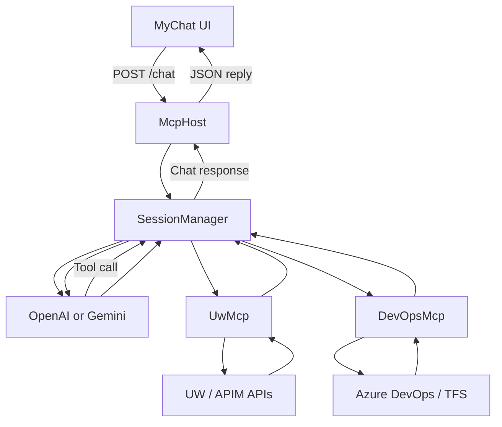
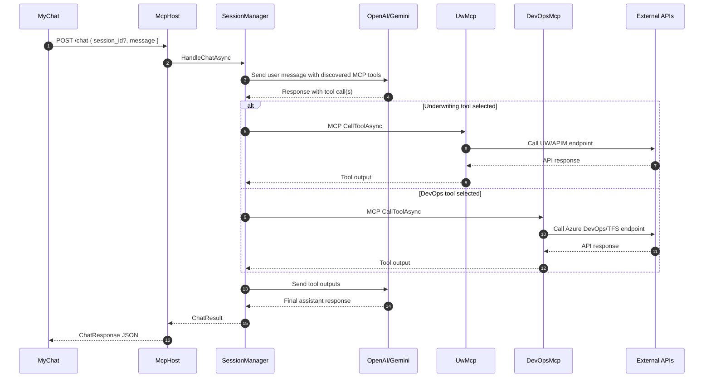
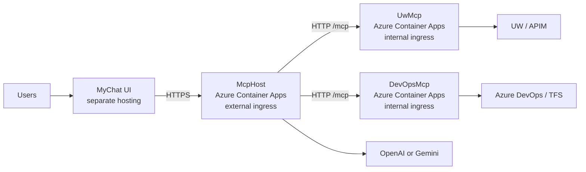

# MCP .NET Backend Platform Design

## Purpose

This document captures the runtime architecture and deployment design for the .NET backend stack:

- `McpHost`
- `Servers/UwMcp`
- `Servers/DevOpsMcp`

`MyChat` remains a separately hosted Angular UI and is not part of the Azure container deployment plan in this document.

## Scope

- Containerize the three backend services for local and cloud execution.
- Keep `McpHost` as the single public backend entrypoint.
- Keep the two MCP servers private to the backend network in Azure.
- Support deployment to Azure Container Apps.
- Allow `MyChat` to point at a non-local backend URL through runtime configuration.

## Component Responsibilities

| Component | Responsibility | Inbound traffic | Outbound traffic |
|-----------|----------------|-----------------|------------------|
| `MyChat` | Browser UI for chat and session operations | End users | `McpHost` HTTP API |
| `McpHost` | Session management, prompt rendering, tool orchestration, LLM integration | `MyChat` and API clients | OpenAI/Gemini, `UwMcp`, `DevOpsMcp` |
| `UwMcp` | Underwriting MCP tool server | `McpHost` via MCP over HTTP | UW/APIM APIs |
| `DevOpsMcp` | Azure DevOps/TFS MCP tool server | `McpHost` via MCP over HTTP | Azure DevOps/TFS APIs |

## Project Layout

The backend now follows a layered multi-project structure instead of keeping each service as a single web project.

### McpHost

- `McpHost`: HTTP API host and startup
- `McpHost.Application`: configuration, contracts, session orchestration, and LLM abstractions
- `McpHost.Infrastructure`: concrete OpenAI/Gemini implementations and correlation infrastructure
- `McpGateway`: shared MCP client integration

### UwMcp

- `UwMcp`: ASP.NET Core MCP host entrypoint
- `UwMcp.Application`: underwriting tool logic and downstream APIM integration

### DevOpsMcp

- `DevOpsMcp`: ASP.NET Core MCP host entrypoint
- `DevOpsMcp.Application`: Azure DevOps/TFS work item logic and HTTP integration

## Request Flow

## Chat Sequence

## Deployment Topology

## Configuration Model

### McpHost

- Public entrypoint.
- Reads defaults from `AppConfig` in `McpHost/appsettings.json`.
- Supports legacy flat environment variable overrides for deployment.
- Must be configured with the private MCP URLs for `UwMcp` and `DevOpsMcp`.
- Must set `CORS_ORIGINS` to the `MyChat` origin used in each environment.

### UwMcp

- Uses `PORT`, `MCP_HTTP_HOST`, and `MCP_HTTP_PATH` for container binding.
- Requires UW/APIM endpoint settings and APIM subscription credentials.

### DevOpsMcp

- Uses `PORT`, `MCP_HTTP_HOST`, and `MCP_HTTP_PATH` for container binding.
- Requires `TFS_BASE_URL`.
- Accepts PAT through `TFS_PAT` or request header `X-TFS-PAT`.

### MyChat

- Should not hardcode a backend URL in non-local environments.
- Uses `window.__myChatConfig.apiUrl` from `src/assets/runtime-config.js`.

## State and Scaling

### Important constraint

`McpHost` currently stores session state in-memory inside `SessionManager`. Because of that:

- `McpHost` is safe at a single replica.
- Horizontal scale-out would risk sending later requests for the same session to a different replica.
- The Azure deployment keeps `McpHost` at `maxReplicas = 1`.

The two MCP servers are better candidates for horizontal scaling because they do not hold browser session state.

## Networking Decisions

- `McpHost` is the only backend service with external ingress.
- `UwMcp` and `DevOpsMcp` are deployed with internal ingress only.
- `McpHost` calls the private MCP services over HTTP inside the Container Apps environment using app-name-based service discovery.
- Browser traffic reaches `McpHost` over HTTPS through Azure Container Apps ingress.

## Security and Secrets

- Secrets are stored as Azure Container Apps secrets.
- Sensitive values are not committed into compose or Bicep defaults.
- `OpenAiApiKey`, `GeminiApiKey`, `APIM_SUBSCRIPTION_KEY_VALUE`, and `TFS_PAT` must come from deployment-time secrets.
- Correlation IDs propagate from `McpHost` into downstream MCP and API calls for tracing.

## Operations and Health

- `McpHost` exposes `/health`, `/sessions`, `/chat`, `/prompts`, and `/prompts/render`.
- Both MCP servers expose `/health` and `/mcp`.
- The public health probe should target `McpHost /health`.
- MCP server health should be monitored internally.

## Failure Modes

- If `UwMcp` or `DevOpsMcp` is unavailable, tool execution fails for the affected capability but the host remains online.
- If the selected LLM provider is unavailable, chat requests fail even when the MCP services are healthy.
- If `MyChat` points at the wrong backend URL or the host CORS list is incomplete, browser calls fail before reaching the host.

## Deployment Artifacts Added

- Backend Dockerfiles for `McpHost`, `UwMcp`, and `DevOpsMcp`
- Root `docker-compose.yml` for local backend orchestration
- `.env.example` template for local secrets and URLs
- Azure Container Apps Bicep deployment under `infra/azure/`
- PowerShell deployment wrapper that bootstraps infra, builds images in ACR, and deploys the apps

## Future Improvements

- Move `McpHost` session state to Redis or another shared store to support horizontal scaling.
- Add CI/CD to build and tag backend images automatically.
- Add managed identity or Key Vault integration so external secrets do not need to be passed directly in deployment parameters.
